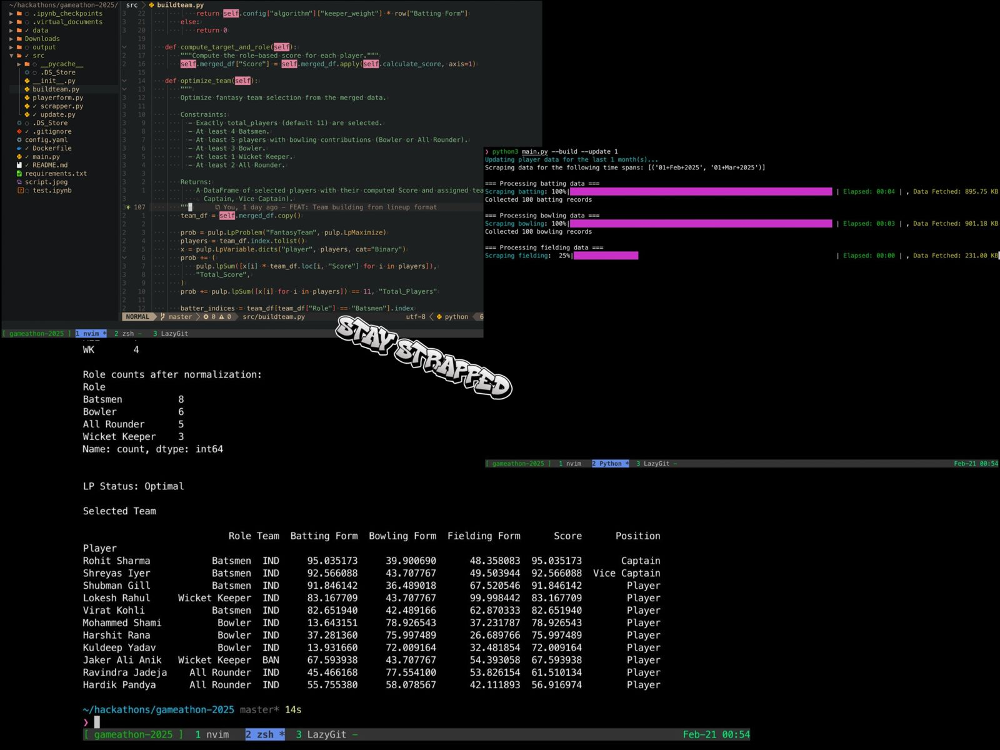

# Cricket Fantasy Team Optimization System

## Overview

This project provides a system for optimizing fantasy cricket team selection using player performance data and roster information. It calculates player form scores based on recent match data and uses these scores to select an optimal team under specific constraints, leveraging a modular design and linear programming techniques.
